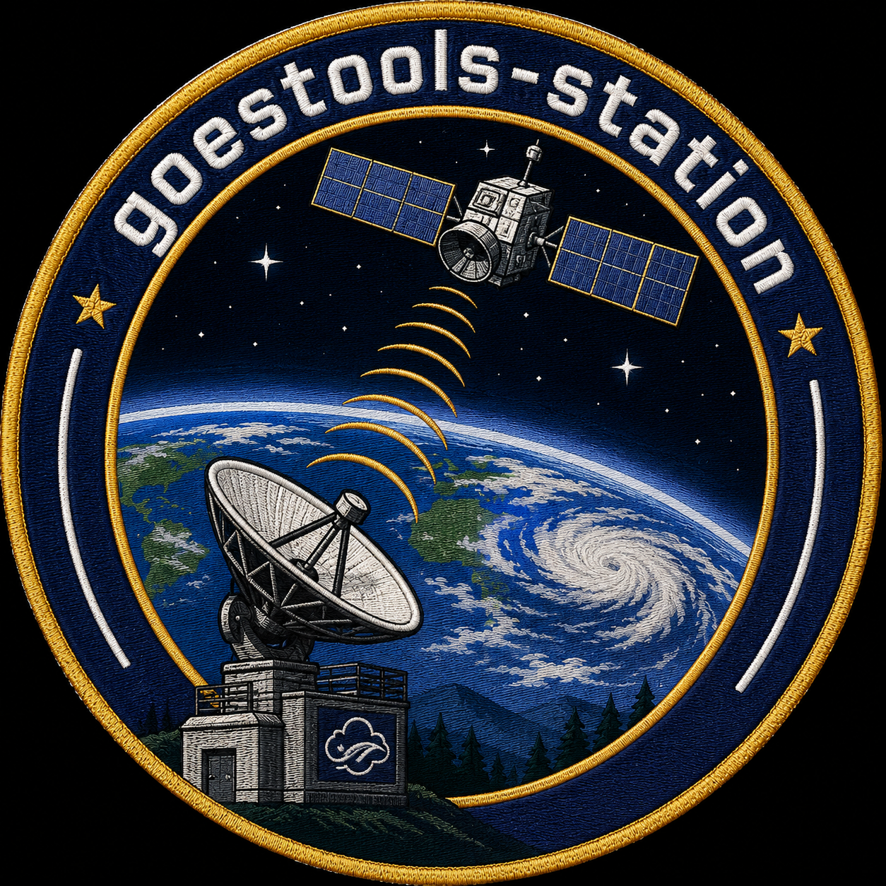

Overview
========

``goestools-station`` is an optional Qt 6 Widgets application for operating a
GOES receive station around the existing command-line tools. It should wrap
the existing receiver and processor tools rather than replacing receiver or
decoder internals.

Goals:

- Provide one desktop UI for common station workflows.
- Start and supervise external ``goestools`` commands.
- Display receiver and decoder health.
- Show live process logs.
- Browse generated products.
- Keep normal command-line builds independent of Qt.
- Keep settings in user-space paths.

The GUI is intentionally a wrapper/dashboard. It should not reimplement or
modify core DSP, demodulation, Viterbi, Reed-Solomon, packet assembly, LRIT, or
EMWIN behavior.

Current tabs:

- Status
- Processes
- Monitor
- Catalog
- Logs
- Settings

Integration Boundaries
----------------------

Preferred integration points are external processes, nanomsg stats publishers,
packet/product output directories, logs, and config files. Avoid changing core
DSP, decoder, packetizer, Viterbi, Reed-Solomon, LRIT, EMWIN, and DCS behavior
for station UI work.

See :doc:`roadmap` for the phased implementation plan.
